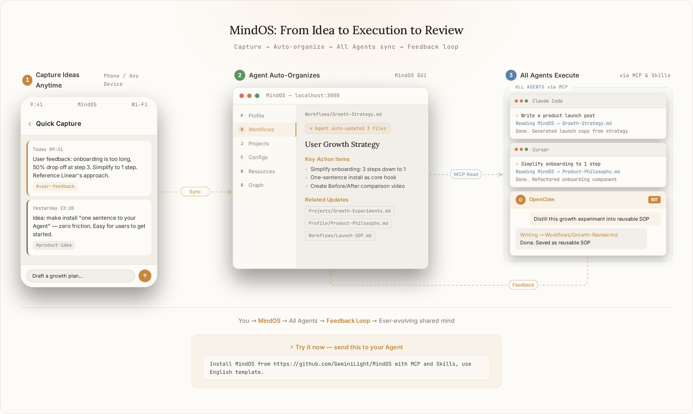
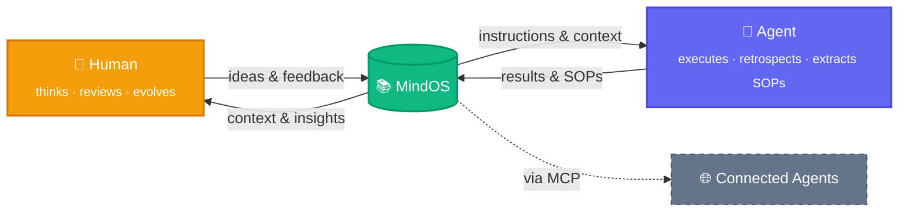

<p align="center">
  
</p>

<h1 align="center">MindOS</h1>

<p align="center">
  <strong>Human Thinks Here, Agents Act There.</strong>
</p>

<p align="center">
  <a href="README.md">English</a> | <a href="README_zh.md">中文</a>
</p>

<p align="center">
  <a href="https://tianfuwang.tech/MindOS"></a>
  <a href="https://www.npmjs.com/package/@geminilight/mindos"></a>
  <a href="#wechat"></a>
  <a href="LICENSE"></a>
</p>

<p align="center">
  <a href="https://github.com/GeminiLight/MindOS/releases?q=desktop"></a>
  <a href="https://github.com/GeminiLight/MindOS/releases?q=clipper"></a>
</p>

MindOS is a local-first knowledge base for sharing durable context between you and the AI agents you use. **Think in one place. Let agents work from shared context.**

---

<p align="center">
  <picture>
    <source media="(prefers-color-scheme: dark)" srcset="assets/images/demo-flow-dark.webp" type="image/webp" />
    <source media="(prefers-color-scheme: dark)" srcset="assets/images/demo-flow-dark.png" />
    <source media="(prefers-color-scheme: light)" srcset="assets/images/demo-flow-light.webp" type="image/webp" />
    <source media="(prefers-color-scheme: light)" srcset="assets/images/demo-flow-light.png" />
    
  </picture>
</p>

<table>
  <tr>
    <td width="50%">
      <picture>
        <source srcset="assets/images/mindos-home.webp" type="image/webp" />
        
      </picture>
    </td>
    <td width="50%">
      <picture>
        <source srcset="assets/images/mindos-chat.webp" type="image/webp" />
        
      </picture>
    </td>
  </tr>
  <tr>
    <td align="center"><em>Home — Knowledge base overview</em></td>
    <td align="center"><em>AI Agent — Proactively understand intent and execute tasks from your knowledge</em></td>
  </tr>
  <tr>
    <td width="50%">
      <picture>
        <source srcset="assets/images/mindos-dashboard.webp" type="image/webp" />
        
      </picture>
    </td>
    <td width="50%">
      <picture>
        <source srcset="assets/images/mindos-echo.webp" type="image/webp" />
        
      </picture>
    </td>
  </tr>
  <tr>
    <td align="center"><em>Agents — Manage all connected AI agents</em></td>
    <td align="center"><em>Echo — Reflect and distill cognitive growth</em></td>
  </tr>
</table>

> [!IMPORTANT]
> **⭐ Agent-assisted install:** Send this to your Agent (Claude Code, Cursor, etc.) to set up MindOS, MCP, and Skills:
> ```
> Help me install MindOS from https://github.com/GeminiLight/MindOS with MCP and Skills. Use English template.
> ```
>
> **✨ Try it now:** After installation, give these a try:
> ```
> Here's my resume, read it and organize my info into MindOS.
> ```
> ```
> Help me distill the experience from this conversation into MindOS as a reusable SOP.
> ```
> ```
> Help me execute the XXX SOP from MindOS.
> ```

## 📢 What's New

MindOS is now organized around a few stable product modules instead of one-off setup scripts:

| Module | What is live |
|------|------|
| **Local Knowledge Workbench** | A desktop/web/CLI workspace for browsing, editing, importing, searching, and organizing a local Markdown knowledge base. |
| **MCP + Skills Bridge** | One command installs or repairs both MCP config and the packaged MindOS Skill, then `mindos doctor agents` verifies real agent readiness. |
| **Native Agent Runtime** | Run agents with resumable sessions, cancellation, reconnect/reattach support, and reviewable output history where the runtime exposes it. |
| **Workflow & Audit Surfaces** | YAML workflows, Agent Inspector, run ledgers, backlinks, graph views, and importer progress help keep human review in the loop. |
| **Cross-platform Delivery** | Install through Desktop releases or `npm install -g @geminilight/mindos@latest`; the npm package includes the CLI and prebuilt local Web runtime. |

## 🧠 Human-AI Shared Mind

> You shape AI through thinking, AI empowers you through execution. Human and AI, growing together in one shared brain.

**1. Global Sync — Breaking Memory Silos**

Switch tools or start a new chat and you're re-transporting context, scattering knowledge. **With a built-in MCP server and packaged Skills, MindOS gives supported Agents a shared path into your core knowledge base. Record profile and project memory once, then reuse it across your AI tools.**

**2. Transparent & Controllable — No Black Boxes**

Agent memory locked in black boxes makes reasoning hard to audit and correct. **MindOS keeps your knowledge base as local plain text and exposes review surfaces for agent runs, file changes, and important tool activity, so you can inspect and adjust the context agents rely on.**

**3. Symbiotic Evolution — Experience Flows Back As Instructions**

You express preferences but the next chat often starts from zero, leaving useful judgment behind. **MindOS helps turn reviewed conversations, corrections, and project standards into reusable notes, Skills, and SOPs, so future agent work can start from a better baseline.**

> **Foundation:** Local-first by default — your knowledge base stays in local plain text for privacy, ownership, and speed.

---

## 🚀 Getting Started

> [!IMPORTANT]
> **Quick Start with Agent:** Paste this prompt into any MCP-capable Agent (Claude Code, Cursor, etc.) to install MindOS, MCP, and Skills, then skip to [Step 3](#3-inject-your-personal-mind-with-mindos-agent):
> ```
> Help me install MindOS from https://github.com/GeminiLight/MindOS with MCP and Skills. Use English template.
> ```

> Already have a knowledge base? Skip to [Step 4](#4-make-any-agent-ready-mcp--skills) to configure MCP + Skills.

### 1. Install

**Option A: Desktop App (macOS / Windows / Linux)**

Download from the [official website](https://tianfuwang.tech/MindOS/#quickstart) or [GitHub Releases](https://github.com/GeminiLight/MindOS/releases/latest) — double-click to install, no terminal needed.

**Option B: npm**

```bash
npm install -g @geminilight/mindos@latest
```

**Option C: Clone from source**

```bash
git clone https://github.com/GeminiLight/MindOS
cd MindOS
pnpm install
pnpm --filter @geminilight/mindos build
cd packages/mindos
pnpm link --global   # registers the `mindos` command globally
```

The npm package intentionally installs both the CLI and the prebuilt local Web runtime. `mindos` is the command entrypoint, while `_standalone/` provides the browser UI used by `mindos start` / `mindos open`; Web source (`packages/web`), tests, wiki, legacy source roots, and dev caches are excluded from the tarball.

### 2. Interactive Setup

```bash
mindos onboard
```

The setup wizard guides you through knowledge base path, template, ports, auth, AI provider, and start mode — all with sensible defaults. Config is saved to `~/.mindos/config.json`. See **[docs/en/configuration.md](docs/en/configuration.md)** for all fields.

> [!TIP]
> On macOS/Linux, choose "Background service" during onboard for auto-start on boot. On Windows CLI installs, use foreground mode; Windows auto-start is handled by the Desktop app. Run `mindos update` anytime to upgrade.

Open the Web UI in your browser:

```bash
mindos open
```

### 3. Inject Your Personal Mind with MindOS Agent

1. Open the built-in MindOS Agent chat panel in the GUI.
2. Upload your resume or any personal/project material.
3. Send this prompt: `Help me sync this information into my MindOS knowledge base.`


### 4. Make Any Agent Ready (MCP + Skills)

**MCP + Skills** (connection + workflow) — one command to install or repair both:

```bash
mindos mcp install        # interactive
mindos mcp install -g -y  # one-shot, global scope
```

Verify the actual agent-facing state:

```bash
mindos doctor agents
mindos doctor agents codex --json
```

> For remote access, manual JSON config, and common pitfalls, see **[docs/en/supported-agents.md](docs/en/supported-agents.md)**.

### 5. Capture from Anywhere

MindOS knowledge doesn't have to start from scratch — bring in what you already have:

- **Drag & Drop**: drop files (PDF, images, Markdown, CSV) into the MindOS GUI — AI auto-organizes them into the right folders.
- **Web Clipper**: install the [browser extension](packages/browser-extension/) to save any web page to your Inbox with one click. Ctrl+Shift+M or right-click → "Save to MindOS".
- **Agent Import**: tell any connected Agent to read a document and sync it into your knowledge base.

## ✨ Features

**For Humans**

- **GUI Workbench**: browse, edit, search notes with unified search + AI entry (`⌘K` / `⌘/`), designed for human-AI co-creation.
- **Built-in Agent Assistant**: converse with the knowledge base in context; edits seamlessly capture human-curated knowledge.
- **One-Click Import**: drag-and-drop files with Inline AI Organize — auto-analyzes, categorizes, and writes into the knowledge base with progress tracking and undo support.
- **Guided Onboarding**: step-by-step first-run experience that helps new users set up their knowledge base and connect their first Agent.
- **Plugin Extensions**: multiple built-in renderer plugins — TODO Board, CSV Views, Wiki Graph, Timeline, Workflow Editor, Agent Inspector, and more.
- **Web Clipper**: browser extension to clip any web page as clean Markdown — one click, saves to Inbox for later AI-powered organizing. [Install →](packages/browser-extension/)

**For Agents**

- **MCP Server + Skills**: stdio + HTTP transports for supported Agents (Claude Code, Cursor, Gemini CLI, Codex, and more), with installer/doctor commands for setup and repair.
- **ACP / A2A Foundations**: early protocol surfaces for agent discovery, registry, session detection, and JSON-RPC messaging. Deeper coordination such as durable mailbox/task-board workflows is still experimental.
- **Workflow Orchestration**: YAML-based workflow editor with a step execution engine to define, edit, and run repeatable agent workflows.
- **Structured Templates**: pre-set directory structures for Profiles, Workflows, Configurations, etc., to jumpstart personal context.
- **Agent-Ready Docs**: everyday notes can become reusable Agent instructions — write context once, then dispatch or refine it.

**Infrastructure**

- **Security**: Bearer Token auth, path sandboxing, INSTRUCTION.md write-protection, atomic writes.
- **Knowledge Graph**: dynamically parses and visualizes inter-file references and dependencies.
- **Backlinks View**: displays all files that reference the current file, helping you understand how a note fits into the knowledge network.
- **Agent Inspector**: renders Agent operation logs as a filterable timeline for reviewing tool calls in detail.
- **Git Time Machine**: Git auto-sync (commit/push/pull) keeps human and Agent edits reviewable, with rollback and cross-device sync.
- **Desktop App**: native macOS/Windows/Linux app with system tray, auto-start, and local process management.

<details>
<summary><strong>Roadmap / Experimental</strong></summary>

- **Retrieval depth**: richer knowledge retrieval and ranking on top of the current local knowledge base and search surfaces.
- **Agent coordination**: deeper ACP/A2A collaboration once durable mailbox, task-board, permission, and artifact contracts are ready.
- **Experience capture**: more guided ways to turn reviewed conversations, corrections, and preferences into reusable Skills/SOPs.
- **Knowledge health**: lightweight signals for stale notes, reused rules, and knowledge that deserves review.

</details>

## ⚙️ How It Works



> **Both sides evolve.** Humans gain new insights from accumulated knowledge; Agents reuse reviewed context and SOPs. MindOS sits at the center — the shared second brain that improves as knowledge accumulates.

---

## 🤝 Supported Agents

MindOS supports the built-in MindOS Agent plus a growing set of CLI, IDE, and extension-based agents. Full list with MCP config paths, Skill paths, and troubleshooting notes: **[docs/en/supported-agents.md](docs/en/supported-agents.md)**

Common examples:

| Agent | MCP | Skills |
|:------|:---:|:------:|
| OpenClaw | ✅ | ✅ |
| Claude Code | ✅ | ✅ |
| Cursor | ✅ | ✅ |
| Codex | ✅ | ✅ |
| Gemini CLI | ✅ | ✅ |
| GitHub Copilot | ✅ | ✅ |
| Trae | ✅ | ✅ |
| CodeBuddy | ✅ | ✅ |
| Qoder | ✅ | ✅ |
| Cline | ✅ | ✅ |
| Windsurf | ✅ | ✅ |
| Hermes | ✅ | - |

---

## 📁 Project Structure

```bash
MindOS/
├── packages/mindos/      # Published runtime package, CLI, server, protocols, and core product logic
├── packages/web/         # Next.js frontend for the local knowledge workbench
├── packages/desktop/     # Electron desktop client and local process management
├── packages/browser-extension/ # Web Clipper browser extension
├── packages/retrieval/   # Optional retrieval/search/vector adapters
├── packages/mobile/      # Expo mobile app
├── skills/               # Packaged MindOS Skills for agents
├── templates/            # Starter knowledge-base templates
├── docs/                 # Public user and contributor docs
└── README.md

~/.mindos/            # User data directory (outside project, never committed)
├── config.json       # All configuration (AI keys, port, auth token, sync settings)
└── mind/             # Your private knowledge base (default path, customizable on onboard)
```

## ⌨️ CLI Commands

> Full command reference: **[docs/en/cli-commands.md](docs/en/cli-commands.md)**

| Command | Description |
| :--- | :--- |
| **Core** | |
| `mindos` | Open the MindOS AI Agent REPL |
| `mindos onboard` / `mindos init` | Interactive setup (config, template, start mode) |
| `mindos onboard --install-daemon` | Onboard and install the background service on macOS/Linux |
| `mindos start` / `mindos start --daemon` | Start Web + MCP services in foreground or as a background service |
| `mindos stop` / `mindos restart` | Stop or restart running processes |
| `mindos status` | Show service status overview (`--json` supported) |
| `mindos open` | Open Web UI in browser |
| **Knowledge** | |
| `mindos file <sub>` / `mindos space <sub>` | File and space operations for the local knowledge base |
| `mindos search "<query>"` | Search the knowledge base |
| `mindos "<task>"` / `mindos -p "<task>"` | Run the MindOS AI Agent with your knowledge base |
| `mindos agent <sub>` | Agent command and management helpers (`list`, `info`, scripted runs) |
| `mindos api <METHOD> <path>` | Raw API passthrough for developers/agents |
| **MCP & Config** | |
| `mindos mcp` | Start the MCP server only |
| `mindos mcp install` | Install or repair MCP config and the MindOS Skill for your Agent |
| `mindos doctor agents [name]` | Verify agent-facing MCP, command, and Skill readiness |
| `mindos token` | Show auth token and per-agent MCP config snippets |
| `mindos config <sub>` | View/update config (`show`, `set`, `validate`) |
| `mindos sync` | Show sync status (init, now, conflicts, on/off) |
| `mindos gateway <sub>` | Manage background service on macOS/Linux (`install`, `start`, `stop`, `logs`) |
| `mindos doctor` / `mindos logs` | Health check and local service logs |
| `mindos update` / `mindos uninstall` | Update or remove MindOS |

**Main keyboard shortcuts:** `⌘K` Search · `⌘/` AI Assistant · `E` Edit · `⌘S` Save · `Esc` Close.

---

## 💬 Community <a name="wechat"></a>

Join our WeChat group for early access, feedback, and AI workflow discussions:

<p align="center">
  
</p>

> Scan the QR code or add WeChat **wtfly2018** to be invited.

---

## 👥 Contributors

<a href="https://github.com/GeminiLight"></a>
<a href="https://github.com/yeahjack"></a>
<a href="https://github.com/USTChandsomeboy"></a>
<a href="https://github.com/ppsmk388"></a>
<a href="https://github.com/U-rara"></a>
<a href="https://github.com/one2piece2hello"></a>
<a href="https://github.com/zz-haooo"></a>
<a href="https://github.com/zjpyb"></a>
<a href="https://github.com/huzhangyi"></a>
<a href="https://github.com/zenozhg"></a>
<a href="https://github.com/octo-patch"></a>

### 🙏 Acknowledgements

This project has been published on the [LINUX DO community](https://linux.do), and we deeply appreciate the community's support and feedback.

---

## 📄 License

MIT © GeminiLight
