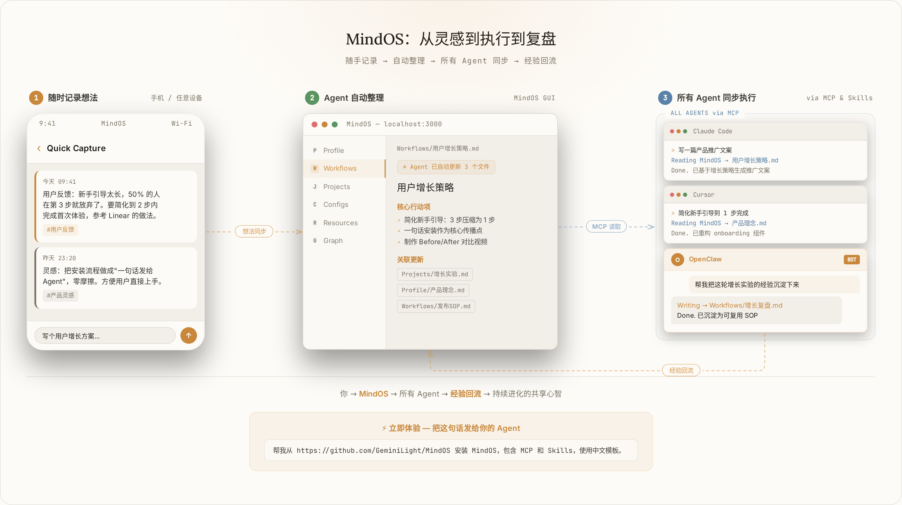
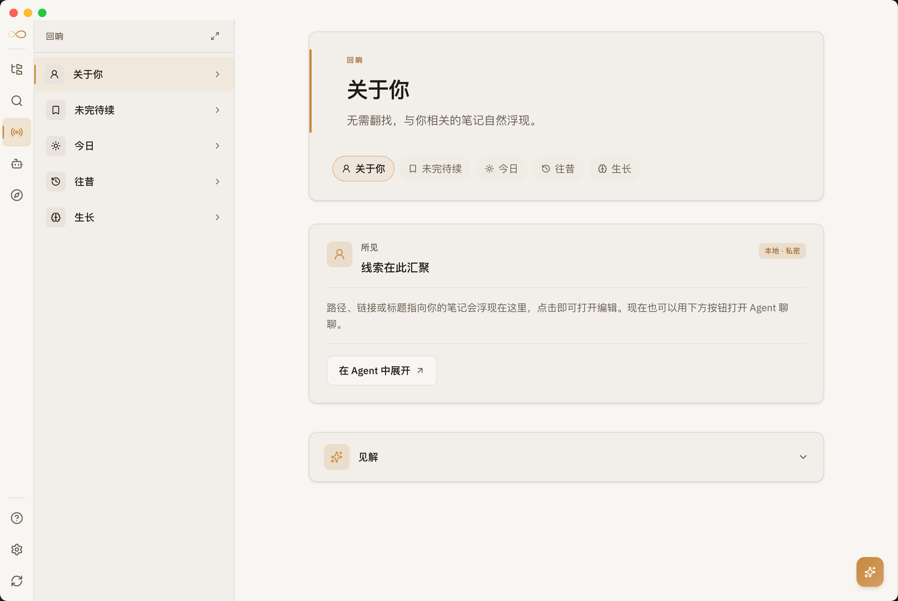
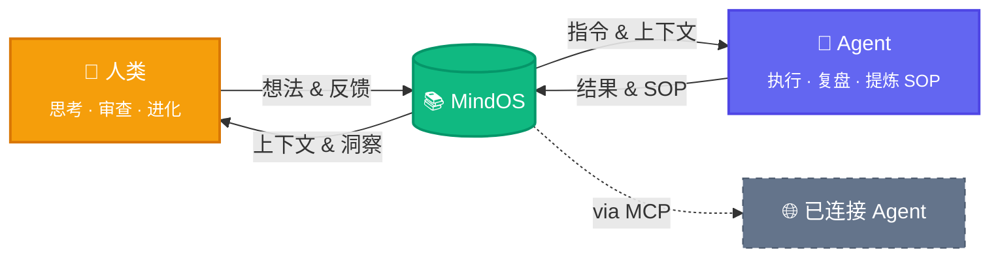

<p align="center">
  
</p>

<h1 align="center">MindOS</h1>

<p align="center">
  <strong>人类在此思考，Agent 依此行动。</strong>
</p>

<p align="center">
  <a href="README.md">English</a> | <a href="README_zh.md">中文</a>
</p>

<p align="center">
  <a href="https://tianfuwang.tech/MindOS"></a>
  <a href="https://www.npmjs.com/package/@geminilight/mindos"></a>
  <a href="#wechat"></a>
  <a href="LICENSE"></a>
</p>

<p align="center">
  <a href="https://github.com/GeminiLight/MindOS/releases?q=desktop"></a>
  <a href="https://github.com/GeminiLight/MindOS/releases?q=clipper"></a>
</p>

MindOS 是一个本地优先的知识库，用来在你和常用 AI Agent 之间共享长期上下文。**在一处思考，让 Agent 带着共同上下文行动。**

---

<p align="center">
  <picture>
    <source media="(prefers-color-scheme: dark)" srcset="assets/images/demo-flow-zh-dark.webp" type="image/webp" />
    <source media="(prefers-color-scheme: dark)" srcset="assets/images/demo-flow-zh-dark.png" />
    <source media="(prefers-color-scheme: light)" srcset="assets/images/demo-flow-zh-light.webp" type="image/webp" />
    <source media="(prefers-color-scheme: light)" srcset="assets/images/demo-flow-zh-light.png" />
    
  </picture>
</p>

<table>
  <tr>
    <td width="50%">
      <picture>
        <source srcset="assets/images/mindos-home.webp" type="image/webp" />
        
      </picture>
    </td>
    <td width="50%">
      <picture>
        <source srcset="assets/images/mindos-chat.webp" type="image/webp" />
        
      </picture>
    </td>
  </tr>
  <tr>
    <td align="center"><em>首页 — 知识库概览</em></td>
    <td align="center"><em>AI Agent — 基于知识库主动识别意图并执行任务</em></td>
  </tr>
  <tr>
    <td width="50%">
      <picture>
        <source srcset="assets/images/mindos-dashboard.webp" type="image/webp" />
        
      </picture>
    </td>
    <td width="50%">
      <picture>
        <source srcset="assets/images/mindos-echo.webp" type="image/webp" />
        
      </picture>
    </td>
  </tr>
  <tr>
    <td align="center"><em>Agent 工作台 — 管理所有已连接的 AI Agent</em></td>
    <td align="center"><em>Echo — 复盘与认知沉淀</em></td>
  </tr>
</table>

> [!IMPORTANT]
> **⭐ Agent 辅助安装：** 把这句话发给你的 Agent（Claude Code、Cursor 等），安装 MindOS、MCP 和 Skills：
> ```
> 帮我从 https://github.com/GeminiLight/MindOS 安装 MindOS，包含 MCP 和 Skills，使用中文模板。
> ```
>
> **✨ 立即体验：** 安装完成后，不妨试试：
> ```
> 这是我的简历，读一下，把我的信息整理到 MindOS 里。
> ```
> ```
> 帮我把这次对话的经验沉淀到 MindOS，形成一个可复用的工作流。
> ```
> ```
> 帮我执行 MindOS 里的 XXX 工作流。
> ```

## 📢 最新动态

MindOS 现在围绕几个稳定的产品模块展开，而不是一组零散安装脚本：

| 模块 | 当前已上线 |
|------|------|
| **本地知识工作台** | 桌面端 / Web / CLI 共同管理本地 Markdown 知识库，支持浏览、编辑、导入、搜索与整理。 |
| **MCP + Skills 桥接** | 一条命令安装或修复 MCP 配置与随包发布的 MindOS Skill，再用 `mindos doctor agents` 验证 Agent 实际可用状态。 |
| **原生 Agent Runtime** | 支持可恢复会话、取消、重连/重新附着，以及在 runtime 暴露能力时记录可审查的输出历史。 |
| **工作流与审计面** | YAML 工作流、Agent Inspector、run ledger、反向链接、知识图谱与导入进度，让人类审查保留在流程里。 |
| **跨平台交付** | 可通过桌面端 Release 或 `npm install -g @geminilight/mindos@latest` 安装；npm 包内置 CLI 与预构建本地 Web runtime。 |

## 🧠 人机共享心智

> 你在思考中塑造 AI，AI 在执行中反哺你。人和 AI，在同一个大脑里共同成长。

**1. 全局同步 — 打破记忆割裂**

切换工具带来上下文割裂，个人深度背景散落各处，导致知识无法复用。**MindOS 内置 MCP Server，并随包提供 Skills，让受支持的 Agent 能共享访问核心知识库。项目记忆与 SOP 只需记录一次，就能在多个 AI 工具里复用。**

**2. 透明可控 — 消除记忆黑箱**

Agent 记忆锁在黑箱中，推理难以审查，错误也难以纠正。**MindOS 以本地纯文本保存知识库，并提供 Agent 运行、文件变更和关键工具活动的审查入口，让你能看见并调整 Agent 所依赖的上下文。**

**3. 共生演进 — 经验回流为指令**

反复表达偏好但新对话又从零开始，思考没有变成可复用的方法论。**MindOS 帮你把经过审查的对话、纠正和项目标准沉淀为笔记、Skills 与 SOP，让后续 Agent 工作从更好的上下文起步。**

> **底层原则：** 默认本地优先，知识库内容以本地纯文本保存，兼顾隐私、主权与性能。

---

## 🚀 快速开始

> [!IMPORTANT]
> **用 Agent 辅助安装：** 将以下指令粘贴到任意支持 MCP 的 Agent（Claude Code、Cursor 等），安装 MindOS、MCP 和 Skills，然后跳到[第 3 步](#3-通过-mindos-agent-注入你的个人心智)：
> ```
> 帮我从 https://github.com/GeminiLight/MindOS 安装 MindOS，包含 MCP 和 Skills，使用中文模板。
> ```

> 已有知识库？直接跳到[第 4 步](#4-让任意-agent-可用mcp--skills)配置 MCP + Skills。

### 1. 安装

**方式 A：桌面客户端（macOS / Windows / Linux）**

从[官网](https://tianfuwang.tech/MindOS/#quickstart)或 [GitHub Releases](https://github.com/GeminiLight/MindOS/releases/latest) 下载安装包，双击安装，无需终端。

**方式 B：npm 安装**

```bash
npm install -g @geminilight/mindos@latest
```

**方式 C：克隆源码**

```bash
git clone https://github.com/GeminiLight/MindOS
cd MindOS
pnpm install
pnpm --filter @geminilight/mindos build
cd packages/mindos
pnpm link --global   # 将 mindos 命令注册为全局命令
```

npm 包会同时安装 CLI 和预构建的本地 Web runtime，这是设计目标：`mindos` 是命令入口，`mindos start` / `mindos open` 使用包内 `_standalone/` 启动浏览器 UI；Web 源码（`packages/web`）、测试、wiki、旧源码根和开发缓存不会进入发布包。

### 2. 交互式配置

```bash
mindos onboard
```

配置向导会引导你完成知识库路径、模板、端口、认证、AI 服务商、启动模式等配置——所有选项都有合理默认值。配置自动保存到 `~/.mindos/config.json`。完整字段说明见 **[docs/zh/configuration.md](docs/zh/configuration.md)**。

> [!TIP]
> macOS/Linux 可在 onboard 中选择"后台服务"实现开机自启。Windows CLI 安装请使用前台模式；Windows 自启动由 Desktop 客户端处理。随时运行 `mindos update` 升级到最新版本。

在浏览器中打开 Web UI：

```bash
mindos open
```

### 3. 通过 MindOS Agent 注入你的个人心智

1. 打开 MindOS GUI 中内置的 Agent 对话面板。
2. 上传你的简历或任意个人/项目资料。
3. 发送指令：`帮我把这些信息同步到我的 MindOS 知识库。`


### 4. 让任意 Agent 可用（MCP + Skills）

**MCP + Skills**（连接能力 + 工作流能力）— 一条命令同时安装或修复：

```bash
mindos mcp install        # 交互式
mindos mcp install -g -y  # 一键全局安装
```

验证 Agent 实际可用状态：

```bash
mindos doctor agents
mindos doctor agents codex --json
```

> 远程配置、手动 JSON 片段、常见误区等详见 **[docs/zh/supported-agents.md](docs/zh/supported-agents.md)**。

### 5. 随时随地捕获知识

MindOS 的知识不必从零开始——把你已有的信息导入进来：

- **拖拽导入**：将文件（PDF、图片、Markdown、CSV）直接拖入 MindOS GUI，AI 自动分析并归档到对应文件夹。
- **网页剪藏**：安装[浏览器插件](packages/browser-extension/)，一键保存任意网页到收集箱。快捷键 Ctrl+Shift+M 或右键菜单 →「Save to MindOS」。
- **Agent 导入**：让任意已连接的 Agent 阅读文档并同步到你的知识库。

## ✨ 功能特性

**人类侧**

- **GUI 工作台**：浏览、编辑、搜索笔记，统一搜索 + AI 入口（`⌘K` / `⌘/`），专为人机共创设计。
- **内置 Agent 助手**：在上下文中与知识库对话，编辑无缝沉淀为可管理知识。
- **一键导入**：拖拽文件即可导入，Inline AI Organize 自动分析、分类、写入知识库，支持进度追踪和撤销。
- **新手引导**：首次使用的分步引导体验，帮助新用户快速搭建知识库并连接第一个 Agent。
- **插件扩展**：多种内置渲染器插件——TODO Board、CSV Views、Wiki Graph、Timeline、Workflow Editor、Agent Inspector 等。
- **网页剪藏**：浏览器扩展，一键将任意网页保存为干净的 Markdown——存入收集箱，稍后 AI 自动整理归档。[安装 →](packages/browser-extension/)

**Agent 侧**

- **MCP Server + Skills**：为受支持的 Agent（Claude Code、Cursor、Gemini CLI、Codex 等）提供 stdio + HTTP 传输，并通过 installer/doctor 命令完成安装与修复。
- **ACP / A2A 基础能力**：提供 Agent 发现、注册表、会话检测与 JSON-RPC 消息等早期协议面；持久 mailbox/task-board 等深层协作仍处于实验阶段。
- **Workflow 编排**：基于 YAML 的可视化工作流编辑器 + 步骤执行引擎，用于定义、编辑和运行可复用的 Agent 工作流。
- **结构化模板**：预置 Profile、Workflows、Configurations 等目录骨架，快速冷启动个人 Context。
- **笔记即指令**：日常笔记可以沉淀为 Agent 可复用、可执行的指令，写下上下文后再调度或持续修订。

**基础设施**

- **安全防线**：Bearer Token 认证、路径沙箱、INSTRUCTION.md 写保护、原子写入。
- **知识图谱**：动态解析并可视化文件间的引用与依赖关系。
- **反向链接视图**：展示所有引用当前文件的反向链接，理解笔记在知识网络中的位置。
- **Agent 审计面板**：将 Agent 操作日志渲染为可筛选的时间线，用于审查工具调用详情。
- **Git 时光机**：Git 自动同步（commit/push/pull），让人类与 Agent 的编辑保留可审查历史，支持回滚与跨设备同步。
- **桌面客户端**：原生 macOS/Windows/Linux 应用，系统托盘、开机自启、本地进程管理。

<details>
<summary><strong>路线图 / 实验能力</strong></summary>

- **检索深度**：在现有本地知识库和搜索能力之上，继续增强检索与排序质量。
- **Agent 协作**：等 mailbox、task-board、权限和 artifact contract 更稳定后，再推进更深层 ACP/A2A 协作。
- **经验沉淀**：提供更顺手的方式，把审查后的对话、纠正和偏好转为可复用的 Skills/SOP。
- **知识健康度**：为过期笔记、被复用的规则和需要复查的知识提供轻量信号。

</details>

## ⚙️ 运作机制



> **双向进化。** 人类从积累的知识中获得新洞察；Agent 复用经过审查的上下文与 SOP。MindOS 居中——随着知识积累不断改进的共享第二大脑。

---

## 🤝 支持的 Agent

MindOS 支持内置 MindOS Agent，也支持一批 CLI、IDE 和扩展类 Agent。完整列表、MCP 配置路径、Skill 路径与常见问题见：**[docs/zh/supported-agents.md](docs/zh/supported-agents.md)**

常见示例：

| Agent | MCP | Skills |
|:------|:---:|:------:|
| OpenClaw | ✅ | ✅ |
| Claude Code | ✅ | ✅ |
| Cursor | ✅ | ✅ |
| Codex | ✅ | ✅ |
| Gemini CLI | ✅ | ✅ |
| GitHub Copilot | ✅ | ✅ |
| Trae | ✅ | ✅ |
| CodeBuddy | ✅ | ✅ |
| Qoder | ✅ | ✅ |
| Cline | ✅ | ✅ |
| Windsurf | ✅ | ✅ |
| Hermes | ✅ | - |

---

## 📁 项目架构

```bash
MindOS/
├── packages/mindos/      # 发布 runtime 包、CLI、server、protocols 与核心产品逻辑
├── packages/web/         # 本地知识工作台的 Next.js 前端
├── packages/desktop/     # Electron 桌面端与本地进程管理
├── packages/browser-extension/ # Web Clipper 浏览器扩展
├── packages/retrieval/   # 可选检索 / 搜索 / 向量适配器
├── packages/mobile/      # Expo 移动端
├── skills/               # 随包发布的 MindOS Skills
├── templates/            # 知识库初始化模板
├── docs/                 # 公开用户文档与贡献者文档
└── README.md

~/.mindos/            # 用户数据目录（项目外，不会被提交）
├── config.json       # 所有配置（AI 密钥、端口、Auth token、同步设置）
└── mind/             # 你的私有知识库（默认路径，onboard 时可自定义）
```

## ⌨️ CLI 命令

> 完整命令参考：**[docs/zh/cli-commands.md](docs/zh/cli-commands.md)**

| 命令 | 说明 |
| :--- | :--- |
| **核心** | |
| `mindos` | 进入 MindOS AI Agent 交互模式 |
| `mindos onboard` / `mindos init` | 交互式初始化（配置、模板、启动模式） |
| `mindos onboard --install-daemon` | 初始化并安装 macOS/Linux 后台服务 |
| `mindos start` / `mindos start --daemon` | 前台或后台启动 Web + MCP 服务 |
| `mindos stop` / `mindos restart` | 停止或重启服务 |
| `mindos status` | 查看服务状态概览（支持 `--json`） |
| `mindos open` | 在浏览器中打开 Web UI |
| **知识库** | |
| `mindos file <sub>` / `mindos space <sub>` | 本地知识库文件与空间操作 |
| `mindos search "<query>"` | 搜索知识库 |
| `mindos "<task>"` / `mindos -p "<task>"` | 基于知识库运行 MindOS AI Agent |
| `mindos agent <sub>` | Agent 命令与管理辅助（`list`、`info`、脚本化运行） |
| `mindos api <METHOD> <path>` | API 透传（开发者/Agent 用） |
| **MCP 与配置** | |
| `mindos mcp` | 仅启动 MCP server |
| `mindos mcp install` | 为 Agent 安装或修复 MCP 配置与 MindOS Skill |
| `mindos doctor agents [name]` | 验证 Agent 侧 MCP、命令与 Skill 可用状态 |
| `mindos token` | 查看认证令牌与各 Agent MCP 配置片段 |
| `mindos config <sub>` | 查看/修改配置（`show`、`set`、`validate`） |
| `mindos sync` | 同步状态（init, now, conflicts, on/off） |
| `mindos gateway <sub>` | 管理 macOS/Linux 后台服务（`install`、`start`、`stop`、`logs`） |
| `mindos doctor` / `mindos logs` | 健康检查与本地服务日志 |
| `mindos update` / `mindos uninstall` | 更新或卸载 MindOS |

**主要快捷键：** `⌘K` 搜索 · `⌘/` AI 助手 · `E` 编辑 · `⌘S` 保存 · `Esc` 关闭。

---

## 💬 社区 <a name="wechat"></a>

加入微信内测群，抢先体验、反馈建议、交流 AI 工作流：

<p align="center">
  
</p>

> 扫码加入，或添加微信 **wtfly2018** 邀请入群。

---

## 👥 贡献者

<a href="https://github.com/GeminiLight"></a>
<a href="https://github.com/yeahjack"></a>
<a href="https://github.com/USTChandsomeboy"></a>
<a href="https://github.com/ppsmk388"></a>
<a href="https://github.com/U-rara"></a>
<a href="https://github.com/one2piece2hello"></a>
<a href="https://github.com/zz-haooo"></a>
<a href="https://github.com/zjpyb"></a>
<a href="https://github.com/huzhangyi"></a>
<a href="https://github.com/zenozhg"></a>
<a href="https://github.com/octo-patch"></a>

### 🙏 致谢

本项目已在 [LINUX DO 社区](https://linux.do) 发布，感谢社区的支持与反馈。

---

## 📄 License

MIT © GeminiLight
